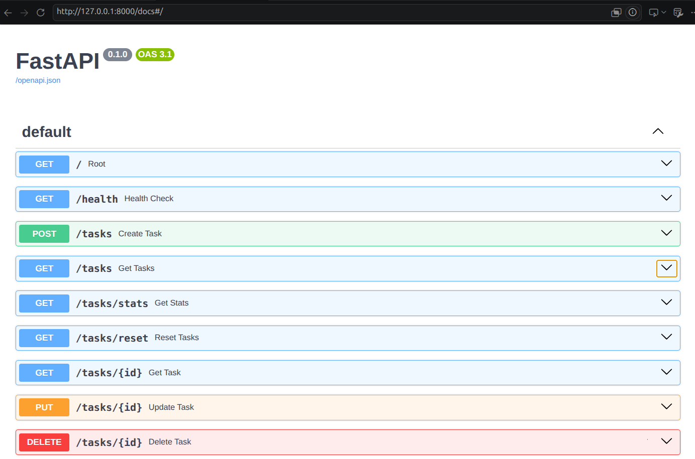
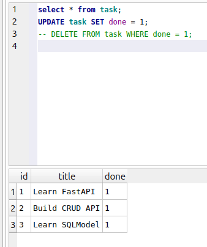

# To-Do List CRUD API (FastAPI)

A simple RESTful To-Do List API built with **FastAPI** that uses an **in-memory database**. It supports all basic CRUD (Create, Read, Update, Delete) operations for managing tasks.

## Features

- Create a new task
- Retrieve all tasks
- Calculate tasks stats
- Reset to inital tasks
- Retrieve a task by ID
- Update an existing task
- Delete a task
- Interactive Swagger UI documentation
- In-memory storage (no external database required)

---

## Installation

### Clone the repository

```bash
git clone https://github.com/Sumitlasiwa/CRUD_API.git
cd CRUD_API
```

### Create and activate a virtual environment (Linux)

```bash
python3 -m venv .venv
source .venv/bin/activate
```

### Install dependencies

```bash
pip install -r requirements.txt
```

---

## Running the Application

Start the development server:

```bash
fastapi dev main.py
```

or, if using Uvicorn:

```bash
uvicorn main:app --reload
```

The API will be available at:

- **API:** http://127.0.0.1:8000/
- **Swagger UI:** http://127.0.0.1:8000/docs
- **ReDoc:** http://127.0.0.1:8000/redoc

---

## Example Request

### Create a Task

```bash
curl -X POST http://localhost:8000/tasks \
-H "Content-Type: application/json" \
-d '{"title":"Buy milk"}'
```

### Example Response

```json
{
  "data": {
    "id": 769639,
    "title": "Buy milk",
    "done": false
  }
}
```

---

## API Endpoints

| Method | Endpoint | Description |
|---------|----------|-------------|
| POST | `/tasks` | Create a new task |
| GET | `/tasks` | Retrieve all tasks |
| GET | `/tasks/stats` | Give tasks stats |
| GET | `/tasks/reset` | Reset to inital tasks |
| GET | `/tasks/{id}` | Retrieve a task by ID |
| PUT | `/tasks/{id}` | Update an existing task |
| DELETE | `/tasks/{id}` | Delete a task |


---

## API Documentation

After starting the server, open the interactive Swagger UI:

**http://127.0.0.1:8000/docs**

This interface allows you to test all CRUD endpoints directly from your browser.

---

## Screenshots

### Swagger UI



---

## Tech Stack

- Python 3
- FastAPI
- Uvicorn
- Pydantic

---

## Notes

- This project uses an **in-memory database**, so all tasks are lost when the server is restarted.
- It is intended for learning and demonstration purposes.


## AI vs Me

 - clean comments and documentations
 - More Schemas with strong field validation
 - database created as List of pydantic objects rather than dictionaries

## Prompt used:
Create a simple and beginner-friendly CRUD REST API for a To-Do List application using FastAPI.

Requirements:
- Use FastAPI and Pydantic.
- Do NOT use any external database (SQLite, PostgreSQL, MongoDB, etc.).
- Store data in an in-memory Python list that acts as the database.
- Initialize the database with these three sample tasks:

[
    {"id": 1, "title": "Learn FastAPI", "done": False},
    {"id": 2, "title": "Build CRUD API", "done": True},
    {"id": 3, "title": "Write API documentation", "done": False}
]

Task model:
- id: int
- title: str
- done: bool

API Endpoints:
1. GET /tasks
   - Return all tasks.
   - Status code: 200 OK

2. GET /tasks/{task_id}
   - Return a single task by ID.
   - Return 404 Not Found if the task does not exist.

3. POST /tasks
   - Create a new task.
   - The client should provide only:
       - title
       - done (optional, default=False)
   - The server should automatically generate a unique integer ID.
   - Return the created task.
   - Status code: 201 Created.

4. PUT /tasks/{task_id}
   - Replace the entire task except for its ID.
   - Return the updated task.
   - Return 404 if the task is not found.
   - Status code: 200 OK.

5. DELETE /tasks/{task_id}
   - Delete the specified task.
   - Return 204 No Content.
   - Return 404 if the task does not exist.

Implementation requirements:
- Create separate Pydantic schemas for:
  - Task (response model)
  - TaskCreate (request model for POST)
  - TaskUpdate (request model for PUT)
- Use response_model for appropriate endpoints.
- Use HTTPException with meaningful error messages.
- Use appropriate HTTP status codes throughout.
- Keep the code clean, readable, and well-commented.
- Avoid unnecessary abstractions or complex patterns.
- Write everything in a single `main.py` file.
- Ensure the code follows FastAPI best practices and is easy for beginners to understand.


# Assignment 2
# sqlite query result


# AI vs me

## input prompt:
You are modifying an existing FastAPI project.

## Scope

* Work **only inside the `ai-version` folder**.
* Do **not** modify, delete, rename, or reference files outside `ai-version`.
* Preserve the existing project structure unless changes are required for the SQLite integration.

## Goal

Migrate the current **in-memory CRUD API** to **SQLite** while following a clean layered architecture:

* Routes Layer → Handles HTTP requests/responses.
* Services Layer → Contains business logic.
* Repositories Layer → Handles database access.
* SQLite database access must use **raw SQL execution only**.
* Do not use ORM features, SQLModel queries, SQLAlchemy ORM, or query builders.
* Use parameterized SQL queries for all user input.

## Architecture Requirements

### Routes Layer

* Handle request parsing and response formatting only.
* No database access.
* No business logic.

### Services Layer

* Contains business logic.
* Calls repository methods.
* Responsible for validation that does not belong in Pydantic schemas.

### Repository Layer

* Contains all SQL statements.
* Responsible for database interaction only.
* No business logic.

---

## Database Requirements

Use SQLite as the persistence layer.

### Table Schema

The tasks table must include:

* id
* title
* done
* created_at
* updated_at

Notes:

* `created_at` is set when a task is created and never changes.
* `updated_at` is updated whenever a task is modified.
* Store timestamps in a consistent SQLite-friendly format (ISO 8601 recommended).

### Startup Initialization

At application startup:

1. Create the tasks table if it does not exist.
2. Check whether the table contains any rows.
3. If the table is empty, insert 3 seed tasks.
4. If data already exists, do not reseed.

### Seed Tasks

Insert these seed records when seeding is required:

* Task 1
* Task 2
* Task 3

Populate `created_at` and `updated_at` appropriately.

---

## CRUD Migration

Replace the current in-memory storage with SQLite persistence while preserving:

* Existing endpoints
* Existing request schemas
* Existing response schemas
* Existing validation behavior
* Existing HTTP status codes
* Existing error responses

The API contract should remain unchanged unless explicitly required below.

---

## Filtering and Sorting

Enhance `GET /tasks` with query parameters.

### Filter by Title

Support:

GET /tasks?title=task

Behavior:

* Return tasks whose title contains the provided text.
* Use SQL filtering.
* Case-insensitive matching if supported by SQLite.

### Filter by Done Status

Support:

GET /tasks?done=true

GET /tasks?done=false

Behavior:

* Return only matching tasks.

### Combined Filtering

Support:

GET /tasks?title=task&done=true

Apply all filters together.

### Sorting

Support:

GET /tasks?order_by=title

GET /tasks?order_by=-title

Behavior:

* `title` → ascending order.
* `-title` → descending order.

Only allow supported sort values.
Return the same validation behavior used elsewhere in the API for invalid input.

---

## Reset Endpoint

Add:

POST /tasks/reset

Behavior:

1. Delete all existing tasks.
2. Reinsert the 3 seed tasks.
3. Return a success response.
4. Seed records should receive fresh timestamps.

---

## Raw SQL Requirement

All database operations must use raw SQL only.

Examples of allowed statements:

* CREATE TABLE
* SELECT
* INSERT
* UPDATE
* DELETE

Do not use:

* SQLModel ORM queries
* SQLAlchemy ORM
* Repository abstractions that hide SQL generation
* Query builders

All SQL should be visible and explicit.

---

## Acceptance Criteria

The implementation is complete only if:

* SQLite replaces all in-memory task storage.
* Routes → Services → Repositories layering is respected.
* All database access uses raw SQL.
* Startup seeding works.
* Empty databases are automatically seeded.
* `POST /tasks/reset` works.
* `created_at` is populated on creation.
* `updated_at` changes on updates.
* Title filtering works.
* Done filtering works.
* Combined filters work.
* Sorting by title works in both directions.
* Existing status codes remain unchanged.
* Existing validation remains unchanged.
* No files outside `ai-version` are modified.

## Deliverables

1. Inspect the current structure inside `ai-version`.
2. Explain the planned changes before coding.
3. Show every modified file.
4. Explain why each file changed.
5. Verify all acceptance criteria after implementation.


# Things AI did better:
 - made internal functions
 - proper query parameter descriptions
 - completely used raw sql even for database creation


 